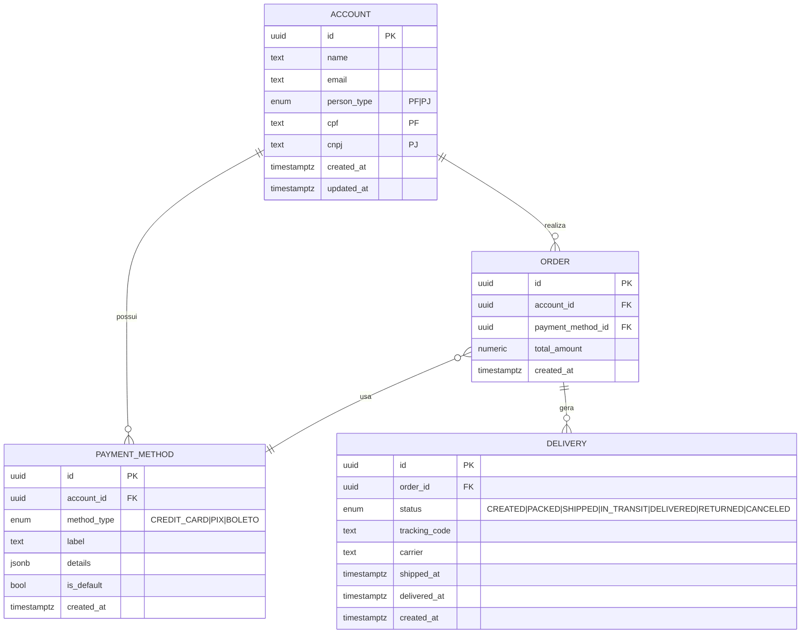

# Desafio de Projeto – Esquema de E-commerce (PF/PJ, Pagamentos e Entrega)

## 1. Objetivo

Refinar o modelo de dados apresentado, acrescentando os seguintes pontos estruturais:

1. **Cliente PJ e PF** – Uma conta pode ser classificada como **Pessoa Jurídica (PJ)** ou **Pessoa Física (PF)**, mas **não pode conter as duas informações simultaneamente**.  
2. **Pagamento** – Cada cliente pode ter **múltiplas formas de pagamento cadastradas**, contemplando, por exemplo, cartões, PIX e boletos.  
3. **Entrega** – Cada pedido deve possuir **status** e **código de rastreio**, de modo a permitir o acompanhamento do processo logístico.

---

## 2. Visão Geral

O presente projeto implementa um modelo conceitual e lógico de banco de dados relacional voltado a um sistema de e-commerce, com ênfase em **consistência de dados, normalização e integridade referencial**. O modelo foi desenvolvido para o **PostgreSQL**, visando atender as regras de negócio especificadas no desafio, garantindo clareza nas relações e facilidade de manutenção.

---

## 3. Requisitos Atendidos

### 3.1 Cliente PJ e PF
- A tabela `account` utiliza o campo `person_type` como discriminador, aceitando apenas os valores `PF` ou `PJ`.  
- Um **constraint CHECK** garante que:  
  - Quando `person_type = 'PF'`, o campo `cpf` é obrigatório e `cnpj` deve ser nulo.  
  - Quando `person_type = 'PJ'`, o campo `cnpj` é obrigatório e `cpf` deve ser nulo.  
- Índices únicos condicionais garantem a **unicidade de CPF e CNPJ**, quando presentes.

### 3.2 Pagamento
- Cada conta (`account`) pode possuir diversas formas de pagamento na tabela `payment_method`.  
- O campo `is_default` permite definir uma forma de pagamento padrão, garantindo que exista, no máximo, uma por conta (através de índice único parcial).  
- O campo `details` utiliza o tipo `jsonb`, permitindo armazenar dados variáveis conforme o tipo de pagamento.

### 3.3 Entrega
- A tabela `delivery` relaciona-se com `order` de forma 1:N.  
- Cada registro de entrega possui `status` e `tracking_code`.  
- Um **constraint CHECK** impõe que, para os status `SHIPPED`, `IN_TRANSIT`, `DELIVERED` e `RETURNED`, o `tracking_code` seja obrigatório.  
- O campo `tracking_code` é único, quando informado, assegurando rastreabilidade sem duplicidade.

### 3.4 Integridade do Pedido
- Um **trigger** foi implementado para garantir que o método de pagamento utilizado no pedido (`order`) pertença ao mesmo cliente (`account`), evitando associações inconsistentes.

---

## 4. Diagrama Conceitual (Mermaid)



## 5. Estrutura do Repositório

A organização dos arquivos foi estruturada de forma a manter a separação entre a documentação técnica e o esquema do banco de dados.

├─ README.md             
└─ schema/

   └─ desafio_ecommerce.sql  (DDL completo com tipos, tabelas, índices e triggers)

---

## 6. Execução do Esquema

### 6.1 Requisitos

- **PostgreSQL 13 ou superior**
- Banco de dados de destino configurado (exemplo: `ecommerce`)

### 6.2 Criação do Banco de Dados

```bash
createdb ecommerce
```
6.3 Aplicação do Script SQL
```
psql -d ecommerce -f schema/desafio_ecommerce.sql
```


